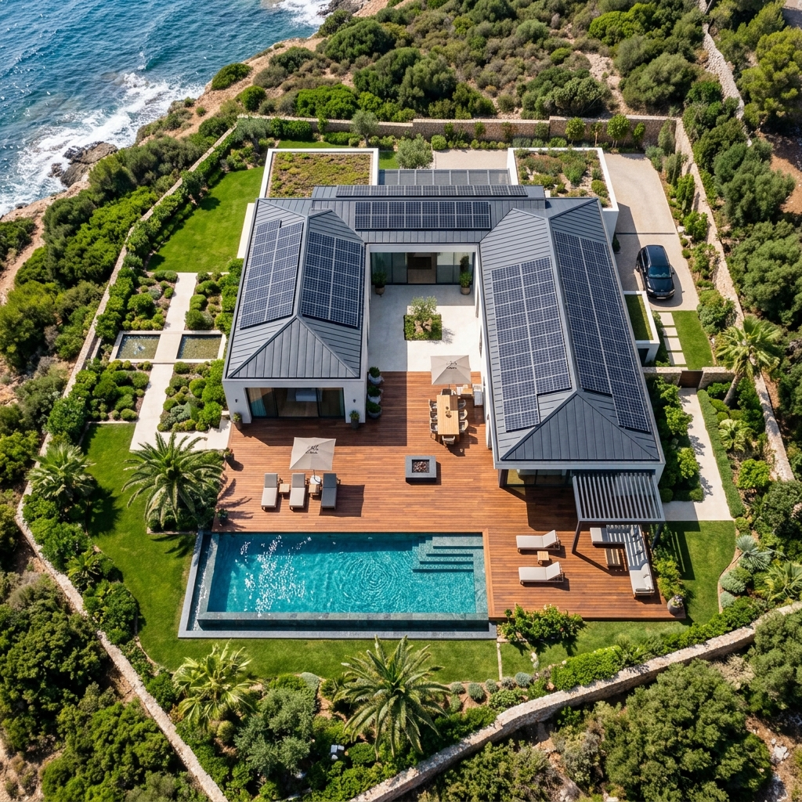

# Three.js Local Procedural Model Exporter

A professional local 3D web editor and multi-format exporter designed for `img2threejs`-style procedural Three.js factories. It renders **real 3D geometry with separated, named parts**, enables hierarchical inspection and transform editing, and exports clean scenes to industry-standard 3D formats (GLB, glTF, USDZ, OBJ+MTL, STL, PLY).



---

## Features

- **✨ Multimodal AI 3D Generation (img2threejs Studio)**:
  - **Upload Any Reference Image**: Drag & drop any photo (architecture, vehicle, drone, furniture, prop).
  - **Direct Vision LLM Integration**: Connect directly to **Google Gemini** (Gemini 2.5 Flash, 1.5 Pro) or **OpenAI** (GPT-4o, GPT-4o-mini, OpenRouter).
  - **Zero Server Setup**: Calls official provider APIs directly from the browser; your API keys are stored securely in local browser storage only.
  - **Automatic 3D Scene Assembly**: Transpiles and renders the generated procedural Three.js geometry with separated, named components and PBR materials.
  - **Automatic Reference Alignment**: Automatically sets your uploaded photo as the viewport comparison overlay with an opacity slider for instant visual parity inspection.
- **Procedural 3D Model Loading & In-Browser Code Execution**:
  - **In-Browser Code Editor ("⚡ Paste / Edit Code")**: Paste arbitrary TypeScript or JavaScript procedural model code directly into the browser. It gets transpiled on-the-fly via Sucrase with full access to `THREE`.
  - **Direct File Upload ("📂 Upload File")**: Upload your generated `.ts`, `.js`, or `.glb` files directly via file picker or drag & drop.
  - **Workspace File Auto-Discovery**: Drop any `.ts` / `.js` file into `src/generated/` and it immediately appears in the model dropdown.
  - **Custom Spec / Config JSON**: Pass custom arguments to `createModel(spec, options)` via the integrated parameter editor.
- **Reference Image Comparison**: Non-destructive reference photo overlay with opacity slider and split view for visual alignment verification (never flattened as fake geometry).
- **Separated Scene Hierarchy**:
  - Full tree inventory (UUIDs, names, types, vertex and triangle counts).
  - Search and filter components by name or object type.
  - Interactive selection linked to 3D raycasting.
  - Inline part renaming without modifying underlying geometries.
  - Part visibility toggle (hide/show), Solo mode, and Lock mode.
- **Transform & Material Inspector**:
  - Real-time Position, Rotation (degrees), and Scale numeric inputs.
  - Geometry diagnostics (vertices, triangles, bounding box dimensions).
  - Material inspector with live color swatches and roughness/metalness parameters.
  - Quick hierarchy navigation: Focus camera, Select parent, Select descendants.
- **Multi-Format Export Pipeline**:
  - **GLB (Binary)**: Full scene or selected subtree using `GLTFExporter` with preserved node names, hierarchy, and materials.
  - **glTF (JSON)**: Formatted JSON glTF with embedded assets.
  - **USDZ**: Optimized for Apple AR / Quick Look / visionOS using `USDZExporter` with automatic PBR material fallback.
  - **OBJ + MTL (ZIP)**: Preserves named `o` and `g` records, generates a companion `.mtl` material file, and bundles them into a `.zip` archive via `JSZip`.
  - **STL & PLY**: Binary/ASCII export for 3D printing and polygon mesh interchange.
- **Export Pre-flight Validation**:
  - Real-time diagnostic card inspecting mesh counts, triangle counts, bounding-box dimensions, and format-specific warnings.
  - Transform normalization: Center model at origin, Ground base at Y=0, Unit scaling (meters, centimeters, millimeters, inches, feet), and Coordinate Up-Axis conversion (Y-up vs Z-up).

---

## Getting Started

### Prerequisites

- Node.js 18+ (tested on Node v20.x)
- npm 9+

### Installation

```bash
npm install
```

### Running Locally (Development)

```bash
npm run dev
```

Open [http://localhost:5173](http://localhost:5173) in your browser.

### Running Smoke Tests

Run the automated test suite verifying factory generation, hierarchy naming, inventory extraction, transform normalization, and exporter packaging:

```bash
npm test
```

### Production Build

```bash
npm run build
```

---

## Procedural Model Factory Specification

A procedural factory should export a function matching the following signature:

```ts
import * as THREE from 'three';

export interface ModelSpec {
  scale?: number;
  [key: string]: unknown;
}

export function createModel(spec?: ModelSpec, options?: unknown): THREE.Group {
  const root = new THREE.Group();
  root.name = 'My_Procedural_Asset';

  // Create separate named meshes with standard PBR materials
  const bodyGeo = new THREE.BoxGeometry(2, 1, 3);
  const bodyMat = new THREE.MeshStandardMaterial({ name: 'Mat_Chassis', color: 0x2563eb });
  const bodyMesh = new THREE.Mesh(bodyGeo, bodyMat);
  bodyMesh.name = 'Chassis_Main';
  root.add(bodyMesh);

  return root;
}
```

Pre-bundled factories included:
1. `src/generated/createModel.ts`: Modern Architectural Compound with plinth, curtain glass, cantilever wing, swimming pool, solar array, and pergola (15+ named parts).
2. `src/generated/createDroneModel.ts`: Modular Autonomous Survey Drone with counter-rotating rotor blades, carbon-fiber boom spars, and articulating multi-sensor gimbal camera (16+ named parts).

---

## Project Structure

```text
├── src/
│   ├── main.ts                   # Application bootstrap and reactive state orchestration
│   ├── style.css                 # Dark-mode glassmorphic CAD UI stylesheet
│   ├── generated/
│   │   ├── createModel.ts        # Architectural villa procedural model factory
│   │   └── createDroneModel.ts   # Quadcopter drone procedural model factory
│   ├── viewer/
│   │   ├── createScene.ts        # Scene, WebGLRenderer, OrbitControls, lights, shadows, cameras
│   │   ├── selection.ts          # Non-destructive raycast selection and BoxHelper highlight
│   │   └── viewModes.ts          # Material (lit), Wireframe, Solid, and Normal preview modes
│   ├── model/
│   │   ├── loadFactory.ts        # Preset registry and GLB file drag-and-drop loader
│   │   ├── inventory.ts          # Scene traversal and inventory stats builder
│   │   ├── cloneForExport.ts     # Deep-clones export subtree and strips editor helpers
│   │   └── normalizeTransforms.ts# Centering, grounding, unit scale, and axis conversions
│   ├── export/
│   │   ├── exportGlb.ts          # GLB binary exporter
│   │   ├── exportGltf.ts         # glTF JSON exporter
│   │   ├── exportUsdz.ts         # USDZ Apple AR exporter
│   │   ├── exportObj.ts          # Wavefront OBJ + MTL generator packaged in ZIP
│   │   ├── exportStl.ts          # STL exporter
│   │   ├── exportPly.ts          # PLY exporter
│   │   ├── validation.ts         # Pre-export validation rules and diagnostic reporting
│   │   └── download.ts           # Browser file trigger utility
│   └── ui/
│       ├── SceneTree.ts          # Expandable hierarchy tree with rename, solo, lock, and search
│       ├── Inspector.ts          # Transform coordinates, geometry metrics, and material controls
│       ├── ExportPanel.ts        # Export settings, validation diagnostics, and download trigger
│       ├── ViewportOverlay.ts    # Perspective/Ortho camera buttons, view modes, and reference overlay
│       └── Toolbar.ts            # Preset switcher, GLB file upload, and background color controls
├── public/
│   └── reference/
│       └── aerial_reference.jpg  # Sample top-down aerial reference photograph
└── tests/
    └── smoke.test.ts             # Vitest automated test suite
```

---

## Verification & Acceptance Criteria

| Criteria | Status | Details |
|---|---|---|
| Real 3D geometry loaded from factory | Verified | Over 15 distinct meshes with custom materials and geometry |
| Separated named parts in Scene Tree | Verified | Tree displays individual names without flattening |
| Part selection & isolation | Verified | Raycast picking with BoxHelper, solo mode, hide/show, and lock |
| GLB / glTF export | Verified | Exports separate mesh nodes and PBR materials |
| Apple USDZ export | Verified | Compatible with Quick Look, automates PBR material conversion |
| Wavefront OBJ + MTL ZIP | Verified | Retains `o` object records, creates companion `.mtl`, packages as `.zip` |
| Reference image comparison | Verified | Overlay with opacity slider; image is never treated as mesh plane |
| Automated Smoke Test | Passed (9/9) | Validates node counts, inventory extraction, transforms, and ZIP packaging |

---

## License

MIT
